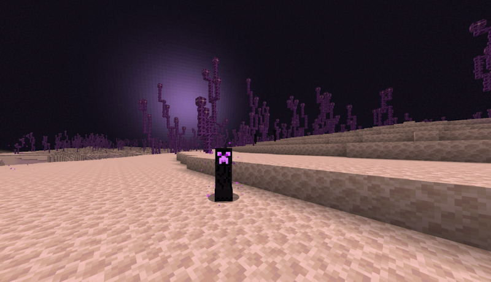
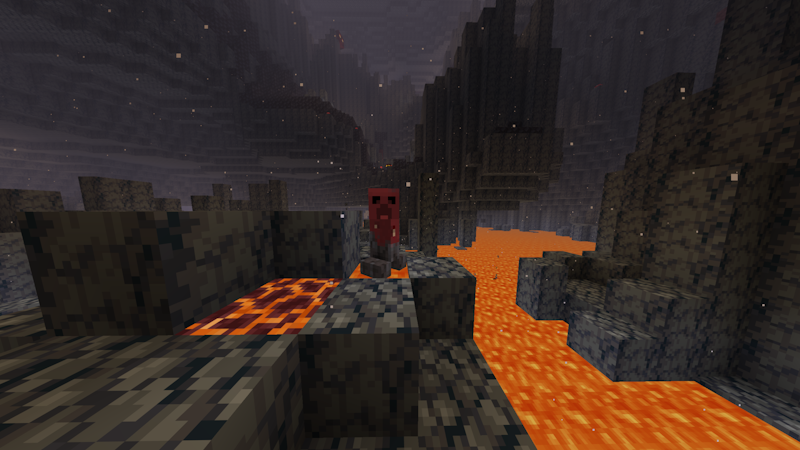
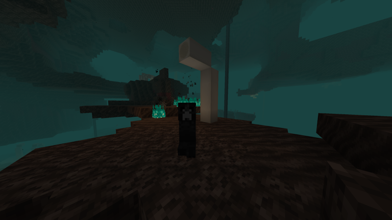

# Creeping Creepers

A Minecraft Forge mod that adds unique Creeper variants with special abilities to your world.

## About

**Creeping Creepers** introduces three new Creeper variants, each themed around a different dimension and featuring unique mechanics that make encounters with them distinct and challenging. All stats are fully configurable via `config/creepingcreepers-common.toml`.

## Requirements

- **Minecraft**: 1.21.11+
- **Forge**: 61.0.6+
- **Java**: 25

## Installation

Drop the mod JAR into your `mods/` folder.

---

## Creeper Variants

### Ender Creeper

A terrifying hybrid combining the explosive nature of Creepers with the teleportation abilities of Endermen.

**Behavior:**
- Hostile mob that detects players within 16 blocks (14 when crouching)
- Teleports randomly when idle, alternating between walking and teleporting like an Enderman
- Teleports toward targets when farther than 13 blocks away, closing the gap instantly
- Dodges all projectiles by teleporting — arrows and other projectiles cannot hit it
- When hit by melee attacks, has a 50% chance to teleport away
- Flees from cats and ocelots within 6 blocks
- Takes damage from water, rain, and splash water bottles (like an Enderman)
- Prevents nearby players from sleeping

**Explosion:**
- Entities caught in the explosion are teleported randomly using Chorus Fruit-style logic (up to 8 blocks away)
- Spawns reverse portal particles at the explosion center

**Stats (defaults):**

| Stat | Value |
|------|-------|
| Health | 14 HP (killable in 2 diamond sword swings) |
| Speed | 0.28 |
| Explosion Radius | 3 blocks |
| Fuse Time | 1.5 seconds |
| Teleport Cooldown | 2 seconds |

**Spawning:**
- **Overworld** — same conditions as Endermen (dark areas); increased spawn rate
- **Nether** — increased spawn rate
- **End** — 20% spawn chance per attempt

**Drops:**
- Gunpowder (0-2, affected by Looting)
- Ender Pearl (0-1, affected by Looting)

---

### Nether Creeper

A lava-dwelling creeper that walks on lava like a Strider and has temperature-based mechanics.

**Behavior:**
- Walks on lava surfaces with full movement speed, similar to a Strider; wanders on lava when idle
- **Aggressively chases players** — will leave lava to pursue players on land or in lava
- When **warm**: prioritizes chasing and exploding at all cost
- When **cold** (out of lava for 10 seconds): abandons the chase and retreats to lava — unless the player is within 6 blocks, in which case it commits to the explosion regardless
- Warms back up 4x faster than it cools down when it returns to lava
- When cold: shivers, moves slower, and explosion is reduced by 80%
- Detects players within 16 blocks (14 blocks if the player is riding a Strider)
- Flees from cats and ocelots within 6 blocks
- Immune to fire and lava damage
- Sensitive to water — takes damage from rain and splash water bottles
- Explosion sets all nearby entities on fire for 3 seconds and spawns flame particles
- Takes gradual freeze damage when cold (1 HP per second after a 3-second delay)

**Stats (defaults):**

| Stat | Value |
|------|-------|
| Health | 20 HP |
| Speed (Warm) | 0.25 |
| Speed (Cold) | 0.15 |
| Explosion Radius (Warm) | 3 blocks |
| Explosion Radius (Cold) | 0.6 blocks (80% reduction) |
| Fuse Time | 1.5 seconds |

**Spawning:**
- **Nether only** — near lava seas at Y level 36 or below; increased spawn rate
- Can spawn in lava, above lava, or on solid ground within 4 blocks of lava
- 20% spawn chance per attempt

**Drops:**
- Gunpowder (0-2, affected by Looting)
- Blaze Powder (0-1, affected by Looting)

---

### Wither Creeper

A dark creeper that lurks in the Nether and inflicts the Wither effect on explosion.

**Behavior:**
- Behaves like a standard Creeper — chases players and explodes on approach
- Flees from cats and ocelots within 6 blocks
- Immune to fire and the Wither effect
- Explosion applies Wither I to all entities within the blast radius for 10 seconds
- Explosion spawns dark smoke particles

**Stats (defaults):**

| Stat | Value |
|------|-------|
| Health | 20 HP |
| Speed | 0.25 |
| Explosion Radius | 3 blocks |
| Fuse Time | 1.5 seconds |
| Wither Duration | 10 seconds |
| Wither Level | Wither I |

**Spawning:**
- **Nether only** — anywhere in the dimension, standard monster spawn rules; increased spawn rate
- 23% spawn chance per attempt

**Drops:**
- Gunpowder (0-2, affected by Looting)
- Coal (0-1, affected by Looting)

---

## Configuration

All values are configurable in `config/creepingcreepers-common.toml`. The config file is generated on first launch and supports hot-reloading — changes take effect immediately when the file is saved.

## License

MIT License

## Credits

Developed by Chompslabs🐊

Thank you to my testers! Y'all the goats. 🐐

[Elephant](https://x.com/EIephantt)🐘
 
Undeadtech💀

